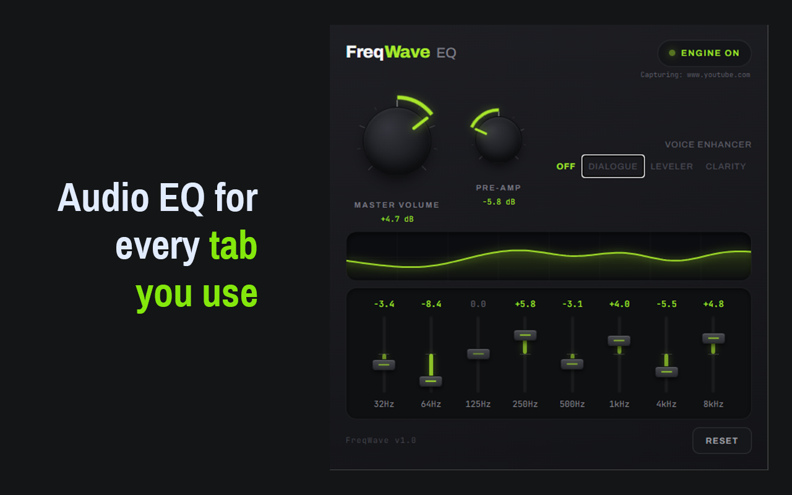

# FreqWave EQ


**FreqWave EQ** is a lightweight, high-performance 8-band audio equalizer and voice enhancement extension for Google Chrome. Built using modern web standards, it processes HTML5 media streams directly in the browser to deliver clearer dialogue, balanced acoustics, and customized playback profiles for videos, podcasts, and music.

---

[](https://chromewebstore.google.com/detail/freqwave-eq/emikokoknlgeiloipjheoafjjeoicjap)
[](LICENSE)
[](https://buymeacoffee.com/borislavginov)

---

## Quick Links

- **Chrome Web Store:** [Install FreqWave EQ](https://chromewebstore.google.com/detail/freqwave-eq/emikokoknlgeiloipjheoafjjeoicjap)
- **Repository / Homepage:** [GitHub Repository](https://github.com/Bob3x/freqwave-eq)
- **Privacy Policy:** [Privacy Policy](docs/privacy.html)

---

## Key Features

- **8-Band Parametric Equalizer:** Precise frequency adjustments across sub-bass, midrange, and treble ranges.
- **Voice Enhancement Modes:** Specialized DSP presets (`DIALOGUE`, `LEVELER`, `CLARITY`) designed to clean up muffled or unbalanced podcast and video audio.
- **Real-Time Spectrum Visualizer:** Live audio frequency response display inside the popup.
- **State Persistence:** Settings are synced across browser restarts and active tabs via `chrome.storage.sync`.
- **Offscreen Processing:** Built on Manifest V3 using an isolated Web Audio API offscreen document for smooth performance.

---

## Technical & Compatibility Boundaries

FreqWave EQ utilizes `chrome.tabCapture` and the Web Audio API to process browser audio:

- **Supported Platforms:** Standard HTML5 `<audio>` and `<video>` media streams across YouTube, SoundCloud, Twitch, podcast portals, news sites, and web media players.
- **Platform Limitations:** Media protected by strict DRM/EME (Encrypted Media Extensions) policies (e.g., Netflix, Spotify Web) restrict direct access to audio nodes at the browser level and are not processable by tab capture extensions.

---

## Installation

### From Chrome Web Store

Install directly from the [Chrome Web Store](https://chromewebstore.google.com/detail/freqwave-eq/emikokoknlgeiloipjheoafjjeoicjap) by clicking **Add to Chrome**.

### Local Development Setup

1. Clone the repository:
    ```bash
    git clone [https://github.com/Bob3x/freqwave-eq.git](https://github.com/Bob3x/freqwave-eq.git)
    cd freqwave-eq
    ```
2. Install dependencies & build:
    ```bash
    npm install
    npm build
    ```
3. Load in Chrome:

- Navigate to chrome://extensions
- Enable Developer mode (top-right toggle)
- Click Load unpacked and select the generated dist/ directory

## Development & Scripts

- `npm run dev` — start Vite development server (popup UI)
- `npm run build` — produce production build (output in `dist/`)
- `npm run lint` — run ESLint

## Architecture & Project Structure

- `src/popup/` — popup UI entry and components
- `src/components/eq/` — EQ UI components (BandFader, Knob, Spectrum, etc.)
- `src/background/` — MV3 service worker (coordination)
- `src/offscreen/` — offscreen document and audio engine
- `src/messages/` — typed message protocol between contexts
- `src/shared/` — shared helpers and settings wrapper

## Where to look

- Engine logic: `src/offscreen/offscreen.ts`
- Service worker: `src/background/service-worker.ts`
- Popup UI: `src/popup/` and `src/components/eq/FreqWavePopup.tsx`

---

## License

This project is open-source under the MIT License.

## Contributing

Contributions, bug reports and feature requests are welcome — please read [CONTRIBUTING.md](CONTRIBUTING.md)
